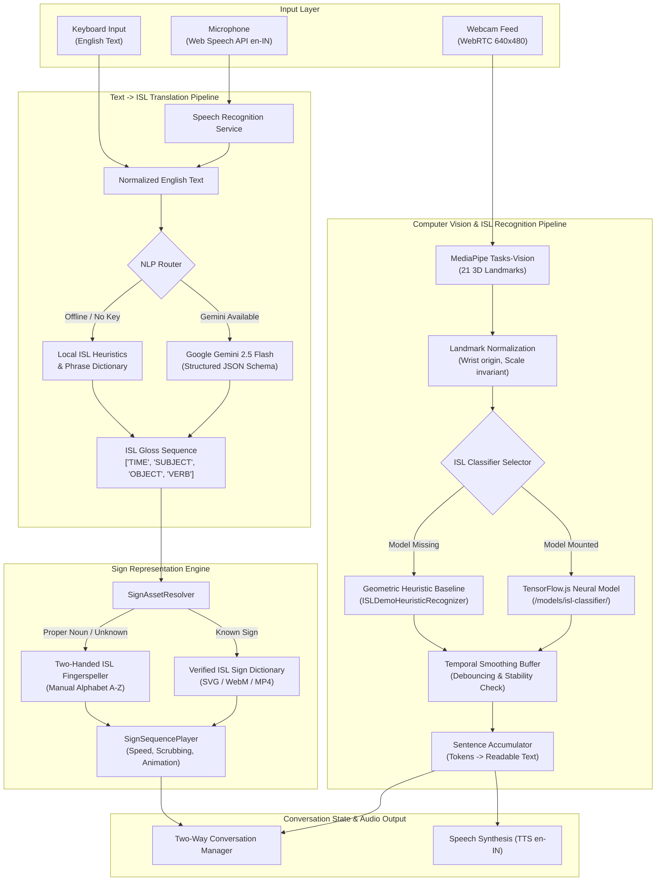

# 🤟 ISL Bridge — AI-Based Indian Sign Language ↔ Speech Communication System

[](https://opensource.org/licenses/MIT)
[](https://www.typescriptlang.org/)
[](https://react.dev/)
[](https://vitejs.dev/)
[](https://developers.google.com/mediapipe)
[](https://www.tensorflow.org/js)
[](https://ai.google.dev/)

**ISL Bridge** is a web-based, real-time accessibility platform designed to bridge the communication divide between the Deaf/Hard-of-Hearing community and hearing individuals across India. It provides a bidirectional bridge combining **continuous computer vision gesture recognition**, **speech-to-text tuned for Indian English (`en-IN`)**, **ISL-oriented NLP gloss translation**, and **visual sign playback**.

---

## 📋 Table of Contents

1. [Project Overview](#1-project-overview)
2. [Key Features](#2-key-features)
3. [System Architecture](#3-system-architecture)
4. [Technology Stack](#4-technology-stack)
5. [Installation](#5-installation)
6. [Running Locally](#6-running-locally)
7. [Environment Variables](#7-environment-variables)
8. [Gemini AI Setup (Direct vs. Secure Proxy)](#8-gemini-ai-setup-direct-vs-secure-proxy)
9. [Camera Permissions & Requirements](#9-camera-permissions--requirements)
10. [Speech Recognition Requirements](#10-speech-recognition-requirements)
11. [ISL Recognition Model Setup](#11-isl-recognition-model-setup)
12. [Sign Asset Setup & Contributor Guide](#12-sign-asset-setup--contributor-guide)
13. [Dataset & Linguistic Grounding](#13-dataset--linguistic-grounding)
14. [License](#14-license)
15. [Limitations & Honest Assessment](#15-limitations--honest-assessment)
16. [Future Roadmap](#16-future-roadmap)
17. [User Interface Overview](#17-user-interface-overview)
18. [Step-by-Step Demo Walkthrough](#18-step-by-step-demo-walkthrough)

---

## 1. Project Overview

Over 18 million individuals in India are Deaf or hard-of-hearing. Indian Sign Language (ISL) is a complete, distinct natural visual-spatial language with its own grammar, lexicon, and syntactic principles. Most hearing people cannot understand ISL, and traditional machine translation services treat sign languages as word-for-word spoken language subtitles, which is linguistically incorrect.

**ISL Bridge** addresses this challenge with a unified, browser-native web interface providing:
- **Sign Language User $\rightarrow$ General User**: Continuous webcam tracking converts ISL hand gestures into verified text sentences with optional speech playback.
- **General User $\rightarrow$ Sign Language User**: Spoken voice or typed English is parsed into ISL gloss grammar and played back as sequential visual sign assets.
- **Shared Two-Way Conversation**: A turn-based chat canvas displaying both participants' communication bubbles with replay, sign synthesis, and speech controls.
- **Hardware-Aware Performance Modes**: Optimized to run smoothly on budget laptops and integrated graphics without overheating or frame lag.

---

## 2. Key Features

- 📹 **Continuous 3D Hand Landmark Tracking**: Tracks 21 3D hand landmarks per hand in real time using MediaPipe Tasks Vision.
- 📐 **Dual Recognition Modes**:
  - **Neural Mode**: Loads custom TensorFlow.js models from `/public/models/isl-classifier/`.
  - **Heuristic Demo Mode**: Robust geometric fallback calculating fingertip distances, extension angles, and dual-hand proximities when neural checkpoints are not present.
- 🎙️ **Microphone Speech Capture**: Native browser speech-to-text with continuous listening, interim transcripts, and automatic locale support for Indian English (`en-IN`).
- 🤖 **Linguistic ISL Glossing Engine**:
  - Contextual NLP powered by **Google Gemini 2.5 Flash** with strict JSON schema validation.
  - **100% Offline Rule-Based Fallback**: Applies Subject-Object-Verb (SOV) restructuring, temporal fronting, copula elimination, and WH-movement locally without API keys.
- 🎞️ **Visual Sign Representation & Player**:
  - Curated, local-first vector SVGs and videos for standard ISL vocabulary.
  - Two-handed Indian manual alphabet fallback (`FS(...)`) for unknown names or entities.
  - Adjustable playback speed (0.5x to 1.5x), looping, frame scrubbing, and dictionary browsing.
- 💬 **Bidirectional Conversation Panel**: Unified chat stream showing message author, source modality, timestamp, gloss tokens, and one-click replay/speak buttons.
- ⚡ **Low-Cost Hardware Optimizations**: Adaptive inference throttling (30 FPS, 15 FPS, 10 FPS), frame skipping, tensor lifecycle management, and canvas render pruning.

---

## 3. System Architecture



---

## 4. Technology Stack

| Layer | Technologies |
| :--- | :--- |
| **Frontend Framework** | React 18.3, TypeScript 5.7, Vite 6.1 |
| **UI & Icons** | Tailwind CSS 3.4, Lucide React, JetBrains Mono font |
| **Vision & Tracking** | MediaPipe Tasks-Vision (`@mediapipe/tasks-vision` v0.10.21, WebAssembly SIMD) |
| **Neural Inference** | TensorFlow.js (`@tensorflow/tfjs` v4.22.0) |
| **Speech Audio** | W3C Web Speech API (`SpeechRecognition`, `SpeechSynthesis`) |
| **NLP & AI Translation** | Google Gen AI SDK (`@google/generative-ai` v0.24.0) with local deterministic fallback |
| **Backend Proxy (Optional)** | Node.js native HTTP server (`server/server.mjs`) or Vercel serverless (`api/translate-gloss.js`) |
| **Verification & Testing** | Node.js automated security audit & pipeline stress benchmark scripts |

---

## 5. Installation

### Prerequisites
- **Node.js**: `v18.0.0` or higher (`v20.x` recommended)
- **npm**: `v9.0.0` or higher
- **Web Browser**: Google Chrome or Microsoft Edge (Chromium-based browsers provide full Web Speech and WebAssembly SIMD support).
- **Hardware**: Working webcam and microphone.

### Setup
```bash
# 1. Clone the repository
git clone https://github.com/your-username/isl-bridge.git
cd isl-bridge

# 2. Install dependencies
npm install

# 3. Create your local environment file
cp .env.example .env.local
```

---

## 6. Running Locally

### Development Server
Start the frontend development server:
```bash
npm run dev
```
Open **`http://localhost:5173`** in Google Chrome or Edge.

### Optional Secure Proxy Server
To test Gemini translation without exposing your API key to client browsers:
```bash
# In a separate terminal tab:
GEMINI_API_KEY="your_api_key_here" npm run server
```
This runs a local proxy at `http://localhost:3001` with endpoint `POST /api/translate-gloss`.

### Production Build & Preview
```bash
# Type check and build static production bundle to dist/
npm run build

# Preview production build locally
npm run preview
```

### Security and Stress Testing
```bash
# Verify no API keys, tokens, or credentials are leaked in codebase
npm run audit:security

# Run latency, frame throughput, and memory leak stress test
npm run test:stress
```

---

## 7. Environment Variables

Configure application settings by modifying `.env.local`:

```ini
# ==============================================================================
# Google Gemini NLP Configuration (Optional)
# ==============================================================================
# Option A: Direct Client Key (Convenient for local personal testing only)
VITE_GEMINI_API_KEY=

# Option B: Secure Backend Proxy URL (Recommended for production)
# e.g.: /api/translate-gloss or http://localhost:3001/api/translate-gloss
VITE_GEMINI_PROXY_URL=

# Model Name
VITE_GEMINI_MODEL=gemini-2.5-flash

# ==============================================================================
# Feature Flags
# ==============================================================================
VITE_ENABLE_GEMINI=true
VITE_ENABLE_SPEECH_RECOGNITION=true
VITE_ENABLE_SIGN_RECOGNITION=true
VITE_ENABLE_SIGN_OUTPUT=true

# ==============================================================================
# Hardware Optimization Profile
# ==============================================================================
# Choose: 'high' (30 FPS), 'balanced' (15 FPS), 'low' (10 FPS / lightweight)
VITE_PERFORMANCE_MODE=balanced
VITE_VISION_TARGET_FPS=30
VITE_VISION_CONFIDENCE_THRESHOLD=0.65

# ==============================================================================
# Speech Recognition
# ==============================================================================
VITE_SPEECH_DEFAULT_LOCALE=en-IN

# ==============================================================================
# Deployment Base Path
# ==============================================================================
# Default './' allows serving from any sub-path (e.g. GitHub Pages https://<user>.github.io/<repo>/)
VITE_BASE_PATH=./
```

> [!CAUTION]
> **Never commit `.env` or `.env.local` to git.** `.env*` files are strictly blocked in `.gitignore`.

---

## 8. Gemini AI Setup (Direct vs. Secure Proxy)

ISL Bridge uses Gemini **only** as an NLP grammar translation layer (converting English text into ISL gloss tokens). It is **not** required for basic app operation.

### Obtaining a Gemini API Key
1. Visit [Google AI Studio](https://aistudio.google.com/).
2. Sign in with your Google Account and generate an API key.

### Deployment Architectures

#### Mode 1: Pure Local Offline Mode (No Key Needed)
- Leave `VITE_GEMINI_API_KEY` and `VITE_GEMINI_PROXY_URL` blank.
- The app automatically uses its built-in rule-based grammar parser and verified phrase dictionary.
- Fully offline and zero cost.

#### Mode 2: Secure Backend Proxy (Recommended for Production & GitHub Pages)
To prevent your API key from appearing in client browser network tabs:
1. Deploy `server/server.mjs` on Render/Railway/Heroku OR use the Vercel serverless route [`api/translate-gloss.js`](file:///c:/Users/rudra/Downloads/ISL%20TRANSLATOR/api/translate-gloss.js).
2. Set `GEMINI_API_KEY` as a private environment variable on your server host.
3. In the client, set `VITE_GEMINI_PROXY_URL=/api/translate-gloss`.

#### Mode 3: Direct Client Key (For Personal Local Testing)
- Set `VITE_GEMINI_API_KEY=AIzaSy...` in `.env.local` or enter it directly into the in-app **Settings Modal**.
- Stored safely in browser `localStorage`.

---

## 9. Camera Permissions & Requirements

- **HTTPS Requirement**: Modern browsers require an encrypted context (`https://`) to access `navigator.mediaDevices.getUserMedia`. The only exception is `http://localhost`.
- **Lighting & Distance**: For optimal 3D landmark tracking, sit 0.5m – 1.5m from the camera with even lighting and contrast between hands and background.
- **Permission Blocked**: If you accidentally deny camera access, click the lock/settings icon in your browser's address bar to reset camera permissions to "Allow".

---

## 10. Speech Recognition Requirements

- **Browser Compatibility**: The Web Speech API is natively supported in **Google Chrome**, **Microsoft Edge**, and Chromium-based browsers.
- **Firefox & Safari**: Desktop Firefox does not currently support `webkitSpeechRecognition`. Safari has experimental partial support. In unsupported browsers, an explanatory badge is shown, and the text input field remains fully functional as a fallback.
- **Indian English Accent**: Default speech recognition is configured to `en-IN` (English India) to optimize phonetic recognition for regional accents.

---

## 11. ISL Recognition Model Setup

ISL Bridge includes a modular inference engine:

```
public/models/isl-classifier/
├── model.json             # TensorFlow.js model topology
├── group1-shard1of1.bin   # Neural model weights
└── labels.json            # Array of class labels (e.g. ["NAMASTE", "HELLO", ...])
```

- **When Checkpoint Files Are Present**: `TensorFlowISLRecognizer` loads the model directly into WebGL/WASM memory and runs neural classification on the 21 normalized landmarks.
- **When Checkpoint Files Are Missing**: The app seamlessly switches to `ISLDemoHeuristicRecognizer`, calculating joint angles, extension ratios, and dual-hand distances. A `DEMO_HEURISTIC` badge is displayed in the UI for complete transparency.

### Currently Recognized Camera Gestures (Heuristic Baseline):
1. `NAMASTE` — Dual palms pressed flat together vertically in front of the chest.
2. `HELLO` — Open palm facing forward, fingers extended upward.
3. `YES` — Thumbs-up gesture.
4. `NO` — Index and middle fingers extended horizontally with snapping motion.
5. `YOU` — Index finger pointing directly forward toward camera.
6. `ONE`, `TWO`, `THREE`, `FOUR`, `FIVE` — Numerical count gestures.
7. `FIST` — Closed fingers indicating resting or stop state.

---

## 12. Sign Asset Setup & Contributor Guide

All signs are stored locally in `public/signs/` to ensure offline functionality without web scraping.

### Sign Dictionary Contents:
- **Greetings**: `HELLO`, `NAMASTE`, `GOOD-MORNING`, `GOOD-NIGHT`
- **Common & Pronouns**: `THANK-YOU`, `PLEASE`, `YES`, `NO`, `I`, `ME`, `MY`, `YOU`, `WE`
- **Questions**: `WHAT`, `WHERE`, `WHO`, `HOW`, `WHEN`, `WHY`
- **Actions & Verbs**: `HELP`, `EAT`, `DRINK`, `GO`, `COME`, `WANT`, `SEE`, `UNDERSTAND`
- **Time & Temporal**: `NOW`, `TODAY`, `TOMORROW`, `YESTERDAY`
- **Essentials & Medical**: `WATER`, `FOOD`, `DOCTOR`, `MEDICINE`, `PAIN`, `HOSPITAL`, `EMERGENCY`
- **Manual Alphabet**: Complete 2-handed fingerspelling for letters `A` through `Z`.

### How Contributors Can Add New Signs:
1. Place a verified vector asset in `public/signs/svg/<sign-name>.svg` or short video in `public/signs/video/<sign-name>.mp4`.
2. Open [`src/modules/sign-output/signDictionary.ts`](file:///c:/Users/rudra/Downloads/ISL%20TRANSLATOR/src/modules/sign-output/signDictionary.ts).
3. Add a new `SignEntry`:
   ```typescript
   'NEW-SIGN': {
     token: 'NEW-SIGN',
     label: 'New Sign Label',
     type: 'svg',
     src: '/signs/svg/new-sign.svg',
     category: 'action',
     durationMs: 1500,
     description: 'Detailed explanation of handshape and movement.',
     source: 'ISLRTC Official Vocabulary',
     license: 'CC-BY-4.0',
     attribution: 'Indian Sign Language Research & Training Centre (ISLRTC)',
   }
   ```
4. Run `npm run build` to verify dictionary integrity.

---

## 13. Dataset & Linguistic Grounding

- **Linguistic Authority**: Indian Sign Language vocabulary guidelines conform to the published standards of the **Indian Sign Language Research and Training Centre (ISLRTC)**, Department of Empowerment of Persons with Disabilities, Ministry of Social Justice and Empowerment, Government of India.
- **ISL vs. ASL / BSL**: ISL uses a **two-handed manual alphabet** (unlike American Sign Language's one-handed alphabet) and has distinctive grammatical markers and regional variations.
- **Landmark Geometry**: Hand landmarks are captured following the standard MediaPipe 21-point topology (wrist, thumb CMC/MCP/IP/TIP, index MCP/PIP/DIP/TIP, middle MCP/PIP/DIP/TIP, ring MCP/PIP/DIP/TIP, pinky MCP/PIP/DIP/TIP).

---

## 14. License

This project is licensed under the [MIT License](LICENSE).  
Linguistic references and sign educational assets are attributed to the Indian Sign Language Research & Training Centre (ISLRTC) under open educational fair-use principles.

---

## 15. Limitations & Honest Assessment

We believe in complete scientific and engineering transparency:

> [!WARNING]
> **Important Project Disclaimers**
> 1. **Prototype Status**: ISL Bridge is an academic, hackathon, and open-source accessibility prototype. It is **not** a certified medical, emergency, or legal translation device.
> 2. **No "100% Translation" Claim**: Automated sign language translation remains an active computer vision research problem worldwide. Lighting variations, camera angles, motion blur, and background clutter can cause misdetections.
> 3. **Non-Manual Markers Not Captured**: Authentic ISL conveys grammatical mood, interrogative markers, and intensity through facial expressions, head tilts, and shoulder shifts. The current system models hand landmarks only.
> 4. **Vocabulary Size**: The prototype covers standard conversational gestures and manual alphabet fingerspelling. It does not replace the complete vocabulary of fluent ISL signers.
> 5. **Grammar Approximations**: The rule-based engine implements an SOV approximation. Real ISL possesses rich spatial indexing, classifier predicates, and topic-comment structures that require ongoing research.

---

## 16. Future Roadmap

- [ ] **Full-Body Holistic Tracking**: Integrate MediaPipe Holistic (Pose + Face Mesh) to capture facial grammar, head tilts, and torso positioning.
- [ ] **Crowdsourced Data Collection Tool**: Web-based landmark recording studio to enable native Deaf contributors across India to record and label new signs.
- [ ] **3D Procedural Avatar**: Replace static 2D vector signs with a smoothly interpolated 3D WebGL avatar capable of continuous spatial signing.
- [ ] **Regional Dialect Support**: Accommodate regional lexical variations across North, South, East, and Western Indian Deaf communities.
- [ ] **Mobile Progressive Web App (PWA)**: Offline caching and on-device WebGPU acceleration for Android and iOS smartphones.

---

## 17. User Interface Overview

```
+------------------------------------------------------------------------------------------+
|  🤟 ISL Bridge — Indian Sign Language Assistant           [Status: Ready]  [⚙ Settings]  |
+-----------------------------+-----------------------------+------------------------------+
|      LIVE CAMERA PANEL      |      TRANSLATION PANEL      |     COMMUNICATION PANEL      |
|                             |                             |                              |
|   +---------------------+   |   Recognized Sign:          |   [ Speech -> ISL ] [ Text ] |
|   |  Webcam Feed with   |   |   +---------------------+   |   +------------------------+ |
|   |  21 3D Landmarks    |   |   |      NAMASTE        |   |   | "Where are you going?" | |
|   |  Overlay            |   |   |     (Conf: 94%)     |   |   +------------------------+ |
|   +---------------------+   |   +---------------------+   |                              |
|                             |                             |   Generated ISL Gloss:       |
|   FPS: 30 | Latency: 12ms   |   Constructed Sentence:     |   [YOU] [WHERE] [GO]         |
|   Tensors: 0 | Mode: Bal.   |   "NAMASTE HOW ARE YOU"     |                              |
|                             |                             |   Visual Sign Player:        |
|   [Start Cam] [Full Screen] |   [🔊 Speak] [📋 Copy]     |   [ ▶ Play ] [ Speed: 1.0x ] |
+-----------------------------+-----------------------------+------------------------------+
|                         SHARED TWO-WAY CONVERSATION BRIDGE                               |
|   🧑 Hearing User: "Where are you going?" -> Gloss: [YOU] [WHERE] [GO]                    |
|   🤟 ISL User: [ME] [COLLEGE] -> "Me college" [🔊 Speak] [▶ Replay]                      |
+------------------------------------------------------------------------------------------+
```

---

## 18. Step-by-Step Demo Walkthrough

Follow these steps for a live presentation or hackathon evaluation:

1. **Launch the Application**:
   Run `npm run dev` and navigate to `http://localhost:5173`.
2. **Grant Browser Permissions**:
   Click "Start Camera" on the left panel and click "Allow" on the camera and microphone prompts.
3. **Test Sign-to-Text Recognition**:
   - Hold your right hand up with an open palm facing the webcam (`HELLO`).
   - Notice the green skeletal landmark overlay, the confidence bar, and the token appearing in the recognized sign box.
   - Press both hands together in front of the camera (`NAMASTE`).
   - Click **"Speak Sentence"** to test browser text-to-speech audio synthesis.
4. **Test Speech-to-ISL Translation**:
   - In the right-hand panel, select the **Speech** tab.
   - Click the microphone button and say clearly: *"Where are you going?"*
   - Observe the speech transcript appear, followed by the ISL gloss transformation: `[YOU] [WHERE] [GO]`.
   - Watch the animated visual sign player cycle sequentially through each sign.
5. **Explore the Sign Dictionary**:
   - Click the **"Dictionary"** button in the top navigation bar.
   - Filter by categories (*Greetings*, *Medical*, *Emergency*, *Actions*) or search for *"Hospital"*.
   - View gesture descriptions and verified licensing attributions.
6. **Demonstrate Conversation Mode**:
   - Scroll to the **Two-Way Conversation** panel.
   - Send a message from both the Hearing side and the ISL side to demonstrate continuous dialogue.
7. **Demonstrate Hardware Performance Modes**:
   - In the Camera Panel or Settings Modal, toggle between **Balanced** (15 FPS), **High** (30 FPS), and **Low** (10 FPS).
   - Observe how CPU/GPU load adjusts while tracking stability remains smooth.

---

<p align="center">
  <b>ISL Bridge</b> — Built with care for universal accessibility and inclusion.
</p>
