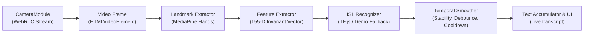
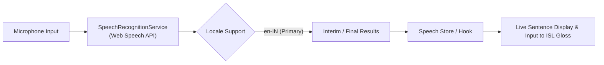
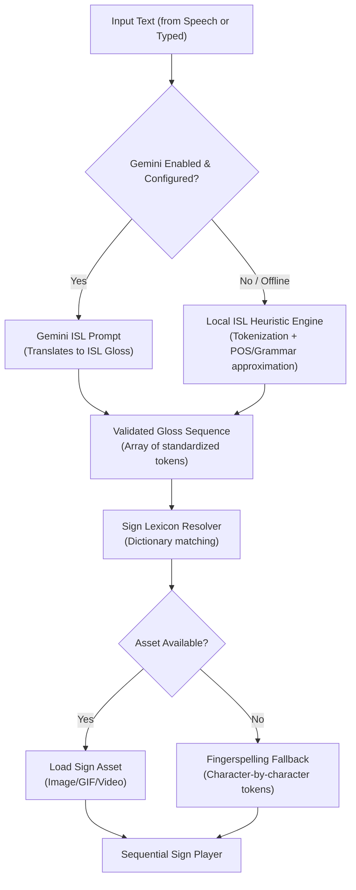

# ISL Bridge — Architecture Document
**AI-Based Indian Sign Language (ISL) ↔ Speech Communication System**

---

## 1. System Overview

**ISL Bridge** is a modular, client-side-first web application designed to bridge the communication gap between the Deaf/Hard-of-Hearing community and hearing individuals across India. The application facilitates two-way communication:

1. **Sign → Text / Speech**: Capturing live video via webcam, detecting hands, extracting spatial landmarks, classifying ISL gestures, and streaming readable text.
2. **Speech → Text**: Capturing microphone audio, transcribing speech (focusing initially on Indian English `en-IN`), and presenting live transcriptions.
3. **Text / Speech → ISL**: Transforming spoken or typed sentences into an ISL gloss sequence using NLP (Gemini API with an intelligent local heuristic fallback), then rendering visual sign representations (sequential images, GIFs, short videos, or fingerspelling) from an extensible sign lexicon.

```
       +----------------------------------------------------------------+
       |                           ISL Bridge                           |
       |                   React + TypeScript + Vite                    |
       +----------------------------------------------------------------+
                                       |
           +---------------------------+---------------------------+
           |                                                       |
+---------------------+                                 +---------------------+
|   INPUT PIPELINES   |                                 |  OUTPUT RENDERING   |
+---------------------+                                 +---------------------+
| 1. Camera Video     |                                 | 1. Recognized Text  |
|    - WebRTC capture |                                 |    - Live transcript|
| 2. ISL Recognition  |                                 |    - Confidence     |
|    - Hand landmarks |                                 | 2. ISL Sign Player  |
|    - Classifier     |                                 |    - Gloss sequence |
| 3. Audio / Speech   |                                 |    - Video/GIF/Img  |
|    - Speech-to-Text |                                 |    - Fingerspelling |
|    - Indian English |                                 | 3. Speech Synthesis |
+---------------------+                                 +---------------------+
           |                                                       ^
           +---------------------------+---------------------------+
                                       |
                         +---------------------------+
                         |    NLP & GLOSS ENGINE     |
                         +---------------------------+
                         | - Gemini LLM (Optional)   |
                         | - Local ISL Heuristic     |
                         | - Lexicon & Dictionary    |
                         +---------------------------+
```

---

## 2. Core Modules & Directory Layout

The application codebase is structured strictly around separation of concerns:

```
src/
|-- assets/               # Static icons, sign media dictionary (images/GIFs)
|-- components/           # Reusable UI components (Navbar, Layout, Card, Badge, Modal)
|-- config/               # Central configuration & feature flag engine
|-- hooks/                # React custom hooks bridging modules to views
|-- modules/
|   |-- camera/           # Video stream management, canvas rendering, framerate loop
|   |-- isl-recognition/  # Vision pipeline, landmark contracts, classifier interface & fallbacks
|   |-- speech/           # Web Speech API wrapper, locale configuration, live transcription
|   |-- nlp/              # English -> ISL gloss engine (Gemini client + local rule-based fallback)
|   |-- sign-output/      # Sequenced sign visualizer, asset resolver, player controls
|-- pages/                # High-level route pages (Sign-to-Text, Speech-to-Sign, Playground, Settings)
|-- services/             # Gemini API client, storage persistence, asset registry
|-- types/                # Strict TypeScript contracts across all domain modules
|-- utils/                # General helpers (math, string formatting, debouncing)
|-- App.tsx               # Root component with routing and feature flag context
`-- main.tsx              # Application entry point
```

---

## 3. Data Flow Between Modules

### 3.1 Live ISL Sign → Text Pipeline



1. **`CameraModule`** streams video frames from `navigator.mediaDevices.getUserMedia` with mirrored/device controls.
2. **`LandmarkExtractor`** processes frames at ~30 FPS to extract 21 3D landmarks for detected hands.
3. **`FeatureExtractor`** computes a position- and scale-invariant 155-dimensional feature vector:
   - Normalized 3D coordinates relative to wrist ($P_0$), scaled by palm size $||P_9 - P_0||$.
   - Radial distances from wrist to all 5 fingertips.
   - Inter-fingertip spread angles/distances.
   - Dual-hand relational vectors ($\Delta x, \Delta y, \Delta z$, inter-wrist distance, index-to-index distance).
4. **`ISLRecognizer`** (`TensorFlowISLRecognizer`):
   - Loads static model from `/models/isl-classifier/model.json`.
   - Never crashes if model is absent: runs non-blocking pre-check and shifts to `ISLDemoHeuristicRecognizer`.
   - Clearly flags state as `tensorflow` (Trained Neural Model) vs `demo-heuristic` (Geometric Baseline).
5. **`TemporalSmoother`**:
   - Confidence thresholding (rejects predictions $< 0.70$).
   - Consecutive frame consistency ($K=6$ frames required).
   - Cooldown period ($1200\text{ms}$) and duplicate word suppression (`HELLO HELLO` $\rightarrow$ `HELLO`).
6. **Data Collection & Training Pipeline**:
   - In-app dataset recording via `LandmarkRecorderModal` with static and 30-frame dynamic sequences.
   - Fully reproducible Python training pipeline under `training/`.

### 3.2 Speech → Text Pipeline



1. Independent from camera processing to prevent audio-video thread locking.
2. Captures interim results for low latency feedback and commits final results on speech pause.
3. Fully configurable to switch locales (default `en-IN`, with support for `hi-IN` when available).

### 3.3 Text / Speech → ISL Pipeline



#### Linguistic Integrity Note on ISL:
- **ISL is not English coded onto hands.** It is a rich, natural visual-spatial language with its own grammar, spatial syntax, non-manual markers (facial expressions, head tilts), and topic-prominent structure (frequently Subject-Object-Verb).
- Simple reversal of English words or word-for-word translation is linguistically incorrect.
- Our local parser uses an **approximation heuristic**:
  1. Identifies and prefixes time/temporal indicators (e.g., *YESTERDAY*, *TOMORROW*, *NOW*).
  2. Identifies subject, object, and verb; groups into an approximated Topic-Comment / SOV format.
  3. Drops English copulas, auxiliary verbs, and articles (*is, are, am, the, a, an*) which do not exist in ISL.
  4. Places question words (*WHAT, WHERE, WHO, WHY*) at the end of the gloss sequence.
- When Gemini is enabled, we provide a specialized few-shot prompt calibrated for ISL gloss generation adhering to these linguistic conventions.

---

## 4. Interfaces and Type Definitions

All inter-module communication is strictly governed by immutable TypeScript contracts defined in `src/types/`:

### 4.1 Feature Flags & Configuration (`src/types/config.ts`)
```typescript
export interface AppConfig {
  features: {
    enableGemini: boolean;
    enableSpeechRecognition: boolean;
    enableSignRecognition: boolean;
    enableSignOutput: boolean;
  };
  gemini: {
    apiKey: string;
    model: string;
  };
  speech: {
    defaultLocale: string;
    continuous: boolean;
    interimResults: boolean;
  };
  vision: {
    targetFps: number;
    detectionConfidenceThreshold: number;
    recognitionCooldownMs: number;
  };
}
```

### 4.2 Hand & Gesture Recognition (`src/types/recognition.ts`)
```typescript
export interface Point3D {
  x: number;
  y: number;
  z: number;
}

export type Handedness = 'Left' | 'Right';

export interface HandLandmarks {
  handIndex: number;
  handedness: Handedness;
  landmarks: Point3D[];          // 21 standard MediaPipe points (0..1)
  normalizedLandmarks: Point3D[];// Wrist-centered & scale-normalized
  boundingBox: BoundingBox;
  score: number;
  timestamp: number;
}

export interface HandLandmarkFrame {
  hands: HandLandmarks[];
  timestamp: number;
}

export interface TemporalSequenceFrame {
  frames: HandLandmarkFrame[];
  windowSize: number; // e.g. 30 frames
  durationMs: number;
}

export interface Prediction {
  label: string;
  gloss: string;
  confidence: number;
  timestamp: number;
  isFallback: boolean;
  modelType: 'tensorflow' | 'demo-heuristic' | 'placeholder';
  isDynamic?: boolean;
  notes?: string;
}

export interface ISLRecognizer {
  readonly id: string;
  readonly name: string;
  readonly version: string;
  readonly isReady: boolean;
  readonly modelType: ModelType;
  readonly status: ModelStatus;
  readonly supportedSigns: string[];

  initialize(): Promise<void>;
  predict(input: HandLandmarkFrame | TemporalSequenceFrame): Promise<Prediction | null>;
  dispose(): void;
}
```

### 4.3 Speech Input (`src/types/speech.ts`)
```typescript
export interface SpeechRecognitionResult {
  transcript: string;
  isFinal: boolean;
  confidence: number;
  timestamp: number;
}

export interface SpeechEngineState {
  isListening: boolean;
  isSupported: boolean;
  error: string | null;
  interimTranscript: string;
  finalTranscript: string;
}
```

### 4.4 ISL Gloss & Sign Representation (`src/types/isl.ts`)
```typescript
export type SignAssetType = 'image' | 'gif' | 'video' | 'fingerspell';

export interface SignAsset {
  token: string;
  type: SignAssetType;
  url: string;
  durationMs?: number;
  label: string;
  description?: string;
  category?: 'alphabet' | 'number' | 'common' | 'greeting' | 'emergency';
}

export interface GlossToken {
  id: string;
  originalWord: string;
  gloss: string;
  matchedAsset?: SignAsset;
  isFingerspelled: boolean;
  note?: string;
}

export interface GlossTranslationResult {
  sourceText: string;
  tokens: GlossToken[];
  source: 'gemini' | 'rule-based-fallback';
  linguisticNotes: string[];
}
```

---

## 5. Architectural Safeguards

1. **Zero Hardcoded Secrets**: All API keys are loaded via `import.meta.env.VITE_*` and can be overridden at runtime via the in-app Settings panel stored in `localStorage`.
2. **Graceful Degradation**: If Web Speech API is unsupported in a browser (e.g., Firefox), the UI indicates the status cleanly and allows text input. If Gemini is unconfigured or rate-limited, the application seamlessly switches to the local rule-based ISL gloss heuristic.
3. **No Fake AI Claim**: The sign classification engine clearly shows whether a real landmark classifier is active, or if it is running in structural landmark tracking with heuristic demo fallbacks.
4. **Independent Modular Lifecycle**: Modules initialize and teardown cleanly without memory leaks or hanging camera/audio streams.

---

## 6. Supported Sign Vocabulary & Model Classification Status

### 6.1 Model Modes
1. **`tensorflow` (Trained Neural Model)**:
   - When a trained checkpoint exists at `/public/models/isl-classifier/model.json` with `labels.json`, TensorFlow.js performs client-side GPU-accelerated forward inference using the extracted 155-dimensional feature vectors.
   - UI status badge: `TF.js Neural Model (Active)`.
2. **`demo-heuristic` (Uncalibrated Geometric Baseline)**:
   - Active by default whenever a trained neural checkpoint is not yet mounted.
   - Evaluates physiological finger extension ratios, joint angles, and dual-hand spatial proximity.
   - UI status badge: `Demo Geometric Heuristic`.
   - Never generates hallucinated signs when hands are in transition or resting.
3. **`placeholder`**:
   - Explicitly reserved for mock testing stubs; forbidden from production runtime.

### 6.2 Supported Vocabulary Classes (Baseline & Classifier Labels)
| Sign Label | Gloss | Hands Required | Description / Articulation |
|---|---|---|---|
| `Namaste` | `NAMASTE` | 2 Hands | Palms pressed flat against each other, fingers pointing upright, hands centered in front of torso. |
| `Hello` | `HELLO` | 1 Hand | Open palm facing forward, fingers extended upward. |
| `Yes` | `YES` | 1 Hand | Closed fist with thumb extended vertically upright (thumbs up). |
| `No` | `NO` | 1 Hand | Index finger extended upright with middle, ring, pinky curled; horizontal gesture. |
| `You` | `YOU` | 1 Hand | Index finger extended directly forward toward interlocutor. |
| `One` | `ONE` | 1 Hand | Index finger extended, remaining fingers curled. |
| `Two` | `TWO` | 1 Hand | Index and middle fingers extended (V-shape), remaining curled. |
| `Three` | `THREE` | 1 Hand | Index, middle, and ring fingers extended. |
| `Four` | `FOUR` | 1 Hand | Index, middle, ring, and pinky extended, thumb folded. |
| `Five` | `FIVE` | 1 Hand | All five fingers fully extended and spread. |
| `Fist` | `FIST` | 1 Hand | All fingers curled into palm with thumb locked over proximal phalanges. |

### 6.3 Data Collection & Custom Model Training
- **In-App Recorder**: Click the **Database icon** in the Live Camera Feed panel to open the dataset collection modal. Collect labeled static frames or 30-frame temporal trajectories, and export directly as `isl_dataset_<timestamp>.json`.
- **Python Training Pipeline**: Run `python training/scripts/train_isl_model.py --dataset path/to/dataset.json` and export with `python training/export/export_to_tfjs.py` directly to `/public/models/isl-classifier/`.
